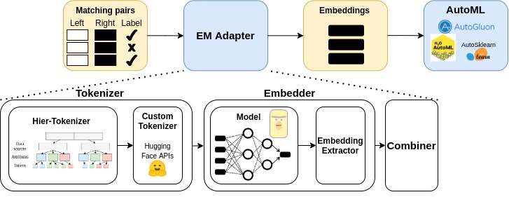

# AutoML for Entity Matching

This project provides an approach for applying automated machine learning techniques (AutoML) for addressing the problem of Entity Matching (EM), i.e. the task of identifying which records in a dataset refer to the same real-world entity. This would make the existing, highly effective, Machine Learning (ML) and Deep Learning (DL) based approaches for EM usable also by non-expert users, who do not have the expertise to train and tune such complex systems.

The proposed approach leverages an **EM Adapter**, to be pipelined with standard AutoML systems, that preprocesses the EM datasets to make them usable by automated approaches and provides greater effectiveness in solving EM tasks. This component relies on the most recent transformer architectures, such as BERT and variants (DistilBERT, ALBERT, RoBERTa and XLNet), and a representation of the entire pipeline is provided in the following figure.

## License
[MIT License](LICENSE)
